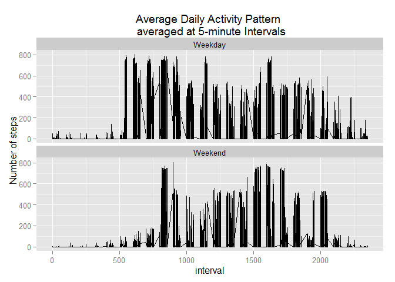

# Reproducible Research: Peer Assessment 1


## Loading and preprocessing the data
<p> The dataset is a comma-separated-value (CSV) file with a total of **17,568** observations</p>

<p> 1. To load the data </p>
<ul>
  <li> unzip the data file (activity.zip) </li>
  <li> read the data using read.csv </li>
</ul>

<p> 2. The results of the loading process is as follows: </p> 


```r
library(dplyr)
```

```
## Warning: package 'dplyr' was built under R version 3.1.3
```

```
## 
## Attaching package: 'dplyr'
## 
## The following object is masked from 'package:stats':
## 
##     filter
## 
## The following objects are masked from 'package:base':
## 
##     intersect, setdiff, setequal, union
```

```r
library(data.table)
```

```
## Warning: package 'data.table' was built under R version 3.1.3
```

```
## 
## Attaching package: 'data.table'
## 
## The following objects are masked from 'package:dplyr':
## 
##     between, last
```

```r
library(knitr)
library(ggplot2)

setwd("~/Coursera/RepData_PeerAssessment1")
unzip("activity.zip")
data <- read.csv("activity.csv")

str(data)
```

```
## 'data.frame':	17568 obs. of  3 variables:
##  $ steps   : int  NA NA NA NA NA NA NA NA NA NA ...
##  $ date    : Factor w/ 61 levels "2012-10-01","2012-10-02",..: 1 1 1 1 1 1 1 1 1 1 ...
##  $ interval: int  0 5 10 15 20 25 30 35 40 45 ...
```

<hr></hr>

## What is mean total number of steps taken per day?


```r
## Dataset: total number of steps taken per day
total_steps_day <- summarize(group_by(data, date), tot_steps = sum(steps, na.rm=TRUE))

## Calculate the mean and median total number of steps taken per day
mean_steps <- mean(total_steps_day$tot_steps, na.rm=TRUE)
median_steps <- median(total_steps_day$tot_steps, na.rm=TRUE)

## histogram of the total number of steps taken each day
qplot(total_steps_day$tot_steps, 
      geom="histogram",
      binwidth = 1000,
      ylim = c(0, 20),
      main = "Total Number of Steps Taken each day",
      xlab = "Total Steps per day")
```

 

```r
summary(total_steps_day) #check mean from summary
```

```
##          date      tot_steps    
##  2012-10-01: 1   Min.   :    0  
##  2012-10-02: 1   1st Qu.: 6778  
##  2012-10-03: 1   Median :10395  
##  2012-10-04: 1   Mean   : 9354  
##  2012-10-05: 1   3rd Qu.:12811  
##  2012-10-06: 1   Max.   :21194  
##  (Other)   :55
```

<p> 1. Total number of steps taken per day (calculation):
<ul>
    <li> Mean: **9,354.23** </li>
    <li> Median: **10,395** </li>
</ul>
</p>
<hr></hr>

## What is the average daily activity pattern?


```r
## Dataset: average number of steps across all the days in the dataset per 5-minute interval
avg_steps_interval <- summarize(group_by(data, interval), avgsteps = mean(steps, na.rm=TRUE))


## Determine the interval with the maximum number of steps
max_interval <- subset(avg_steps_interval, avgsteps == max(avgsteps))

##  Time series plot (i.e. type = "l") of the 5-minute interval (x-axis) 
##  and the average number of steps taken, averaged across all days (y-axis)
with (avg_steps_interval, 
    plot(interval, avgsteps, 
           type="l",
           main = "Average Daily Activity Pattern \n averaged at 5-minute Intervals across all days",                       
           xlab = "Interval",
           ylab = "Average number of steps"))
```

 

<p> 2. Which 5-minute interval, on average across all the days in the dataset, contains the maximum number of steps? **835** </p>

<hr></hr>


## Imputing missing values
#### Strategy: *replace NAs with mean for that 5-minute interval*


```r
## Calculate number of missing values
num_missing_vals <- sum(is.na(data$steps))

## Dataset: Original dataset merged with data from 5-minute interval dataset.
adj_data <- data.table(merge(data, avg_steps_interval, by="interval"))

## Make a copy step data for adjustment
adj_data$adj_steps <- adj_data$steps

## Replace NAs (step) with 5-minute interval average
adj_data[is.na(adj_data$adj_steps), adj_steps := as.integer(avgsteps)]
```

```
##        interval steps       date avgsteps adj_steps
##     1:        0    NA 2012-10-01 1.716981         1
##     2:        0     0 2012-11-23 1.716981         0
##     3:        0     0 2012-10-28 1.716981         0
##     4:        0     0 2012-11-06 1.716981         0
##     5:        0     0 2012-11-24 1.716981         0
##    ---                                             
## 17564:     2355     0 2012-10-07 1.075472         0
## 17565:     2355     0 2012-10-25 1.075472         0
## 17566:     2355     0 2012-11-03 1.075472         0
## 17567:     2355    NA 2012-10-08 1.075472         1
## 17568:     2355    NA 2012-11-30 1.075472         1
```

```r
## Calculate total steps taken per day adjusted and with NA
total_steps_day <- summarize(group_by(adj_data, date), 
                             tot_steps_adj = sum(adj_steps), 
                             tot_steps_na = sum(steps, na.rm=TRUE))

## Calculate the mean and median total number of steps taken per day
mean_steps <- mean(total_steps_day$tot_steps_adj)
median_steps <- median(total_steps_day$tot_steps_adj)

## histogram of the total number of steps taken each day
qplot(total_steps_day$tot_steps_adj, 
      geom="histogram",
      binwidth = 1000,
      ylim = c(0, 20),
      main = "Total number of steps taken each day \n (Missing Data imputed: tot_steps_adj)",
      xlab = "Total Steps per day")
```

 

```r
tbl <- total_steps_day[total_steps_day$tot_steps_na == 0, ]
```

<p> 1. Total number of missing values in the dataset: **2304** </p>

<p> 2. Strategy: replace NAs with mean for that 5-minute interval </p>

<p> 4. Total number of steps taken per day: 
<ul>
      <li> Mean: **10,749.77** </li>      
      <li> Median: **10,641** </li>
</ul></p>


<p> 4. The impact of imputing missing data on the estimates of the total daily number of steps is: 
<ul>
    <li> the **(8) days** when no data is recorded are now plotted as 10641 (count is higher) instead of 0 </li>
    <li> the mean and median scores are higher </li>
</ul></p>


date          tot_steps_adj   tot_steps_na
-----------  --------------  -------------
2012-10-01            10641              0
2012-11-04            10641              0
2012-11-30            10641              0
2012-11-14            10641              0
2012-11-09            10641              0
2012-11-01            10641              0
2012-11-10            10641              0
2012-10-08            10641              0


## Are there differences in activity patterns between weekdays and weekends?


```r
## new factor variable in the dataset with two levels -- "weekday" and "weekend" 
adj_data$day_wk <- as.factor(as.POSIXlt(adj_data$date)$wday)

adj_data$wk_end <- as.factor("Weekday")
adj_data[as.character(adj_data$day_wk) %in% c("5":"6"), wk_end := as.factor("Weekend")]
```

```
##        interval steps       date avgsteps adj_steps day_wk  wk_end
##     1:        0    NA 2012-10-01 1.716981         1      1 Weekday
##     2:        0     0 2012-11-23 1.716981         0      5 Weekend
##     3:        0     0 2012-10-28 1.716981         0      0 Weekday
##     4:        0     0 2012-11-06 1.716981         0      2 Weekday
##     5:        0     0 2012-11-24 1.716981         0      6 Weekend
##    ---                                                            
## 17564:     2355     0 2012-10-07 1.075472         0      0 Weekday
## 17565:     2355     0 2012-10-25 1.075472         0      4 Weekday
## 17566:     2355     0 2012-11-03 1.075472         0      6 Weekend
## 17567:     2355    NA 2012-10-08 1.075472         1      1 Weekday
## 17568:     2355    NA 2012-11-30 1.075472         1      5 Weekend
```

```r
ggplot(adj_data, aes(interval, adj_steps)) + geom_line() + facet_wrap(~wk_end, nrow=2) + labs(title = "Average Daily Activity Pattern \n averaged at 5-minute Intervals") + ylab("Number of steps") + theme(legend.position = "top")
```

 
